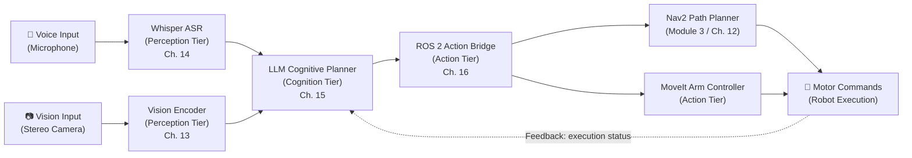

import RagChatbot from '@site/src/components/RagChatbot';

# Chapter 16 — Capstone: Building an Autonomous Humanoid

:::note Non-Linear Reading Note
This chapter is the integration capstone for the entire textbook. Each section references specific earlier chapters where the building blocks were introduced. If you have not read the prior chapters, the cross-references throughout this chapter will guide you to the relevant context. The pipeline diagram and the surrounding prose are written to be understandable in both linear and non-linear reading orders.
:::

## Learning Objectives

By the end of this chapter, you will be able to:

- Trace the complete system from voice input to robot movement through the five-node pipeline: Voice → Whisper → LLM → ROS 2 Bridge → Nav2 / Motor
- Identify which prior module and chapter introduced each component in the pipeline
- Explain the ROS 2 Action Bridge interface — how it consumes the JSON action array and maps each primitive skill to a Nav2 goal or MoveIt trajectory
- Describe how the LLM receives feedback from the Action tier for replanning when a skill fails
- Articulate why the capstone architecture is a synthesis of all four modules, not an extension of Module 4 alone

---

## The Full System Pipeline

This chapter assembles the components from all four modules into a single coherent system. Before examining each component in detail, here is how the four modules contributed the pieces:

- **Module 1 (Chapters 1–4)** introduced ROS 2 as the communication backbone — topics, nodes, and the publish/subscribe architecture that wires every component together. The ROS 2 Action Bridge in this chapter is a ROS 2 node communicating over the same interfaces you first encountered in Chapter 2.

- **Module 2 (Chapters 5–8)** introduced Gazebo and Isaac Sim as digital twin environments. The complete capstone system can be deployed and tested inside these simulated environments before any hardware is involved, using the physics and sensor simulation capabilities from Chapters 5 and 8.

- **Module 3 (Chapters 9–12)** introduced the perception stack and Nav2 bipedal navigation. The `navigate_to` skill in the capstone's JSON action schema is fulfilled by Nav2 — the same navigation middleware introduced in Chapter 12, complete with its three bipedal constraints.

- **Module 4 (Chapters 13–15)** introduced the three-tier VLA architecture: Whisper for Perception (Chapter 14), the LLM cognitive planner for Cognition (Chapter 15), and the ROS 2 Action Bridge for Action (this chapter).

---

## The Pipeline Diagram

The diagram below shows the complete system. Each node is labelled with the chapter where it was introduced.



For readers where the diagram does not render, here is the same pipeline described in text:

- **Voice Input (Microphone)**: The human's spoken command enters the system as raw audio bytes.
- **Whisper ASR** (Chapter 14, Perception Tier): Converts the audio stream — through chunking, spectrogram generation, and token decoding — into a natural-language string.
- **Vision Input (Stereo Camera)**: The robot's camera provides a continuous visual feed of the current environment.
- **Vision Encoder** (Chapter 13, Perception Tier): Converts the camera frame into a visual context representation that the LLM can reason about alongside the text string.
- **LLM Cognitive Planner** (Chapter 15, Cognition Tier): Receives both the text string and the visual context. Using the system prompt (role definition, schema, output-format constraint), it generates a JSON action array.
- **ROS 2 Action Bridge** (this chapter, Action Tier): Parses and validates the JSON array. Dispatches each primitive skill to the appropriate ROS 2 interface.
- **Nav2 Path Planner** (Module 3, Chapter 12): Receives `NavigateToPose` action goals from the bridge and plans footstep sequences that respect bipedal stability constraints.
- **MoveIt Arm Controller**: Receives `MoveGroup` goals from the bridge and plans arm trajectories for grasping and placing objects.
- **Motor Commands**: The physical output — joint positions and torques that cause the robot to move.
- **Feedback (dashed arrow)**: After each skill executes, Nav2 and MoveIt return completion status to the Action Bridge, which forwards it to the LLM for replanning if needed.

---

## The ROS 2 Action Bridge

The ROS 2 Action Bridge is the keystone of the Action tier. It performs three functions: parsing and validating the JSON array from the Cognition tier, dispatching each skill to the correct ROS 2 interface, and collecting execution feedback to return to the LLM.

### JSON Parsing and Validation

The bridge receives the JSON action array produced by the LLM. It parses the array and checks every element against the schema: each object must contain `skill`, `target`, and `parameters`, and the `skill` value must be a recognised primitive. Elements that fail validation trigger the retry-with-feedback loop described in Chapter 15. Elements that pass proceed to dispatch.

### Skill Dispatch

For each valid element, the bridge maps the `skill` field to a ROS 2 interface:

| Skill | ROS 2 Interface | Destination |
|---|---|---|
| `navigate_to` | `NavigateToPose` action | Nav2 (Module 3, Chapter 12) |
| `return_to` | `NavigateToPose` action | Nav2 (Module 3, Chapter 12) |
| `grasp` | `MoveGroup` action | MoveIt arm controller |
| `place` | `MoveGroup` action | MoveIt arm controller |
| `scan` | Point-cloud sweep + object detection | Perception stack |
| `wait` | Timer | Action Bridge internal |

Each dispatch is sequential by default: the bridge sends a goal, waits for the result, then dispatches the next skill. This ensures the robot completes each step before starting the next — it does not, for example, reach for an object while still walking toward it.

### Feedback Collection

After each skill execution, Nav2 and MoveIt return a completion status: `succeeded`, `failed`, or `preempted`. The bridge aggregates these results.

On `succeeded`: mark the skill complete, move to the next skill in the array.

On `failed`: pause execution and send a failure context message back to the LLM:

> *"Skill `grasp(red_mug)` failed: object not found at expected position (x: 1.2, y: 0.3, z: 0.8). Please generate a revised plan."*

The LLM receives this message as a new turn in its context and produces a revised JSON array — perhaps adding a `scan` step first to locate the object's updated position before attempting the grasp again. This closes the feedback loop shown by the dashed arrow in the pipeline diagram.

---

## Cross-Module Integration References

This section maps each pipeline node to the chapter where it was introduced. A student who has completed all four modules can use this as a traceability guide.

### 1. Module 1, Chapter 2 — ROS 2 Topics and Nodes

Every communication link in the pipeline diagram is a ROS 2 topic, service, or action. The ROS 2 Action Bridge is itself a ROS 2 node — it subscribes to a topic carrying the JSON action array and publishes to the `NavigateToPose` and `MoveGroup` action servers. Chapter 2 introduced nodes, topics, and the publish/subscribe architecture. The capstone is a direct application of that architecture at the system scale: seven nodes, communicating over topics and action interfaces, coordinated by a central bridge.

### 2. Module 2, Chapters 5–8 — Gazebo and Isaac Sim as Test Environments

The complete five-node pipeline can be deployed inside the Gazebo or Isaac Sim digital twin environments from Module 2 before any physical hardware is used. A bug in the Action Bridge that sends an invalid MoveIt goal can cause a physical robot arm to move dangerously — but in Gazebo (Chapter 5), the same bug produces a simulation error with no physical consequences. Chapter 8's sensor simulation provides the stereo camera feed that the Vision Encoder and Whisper receive during simulation. Testing in these environments is not optional — it is the step that separates a working capstone from a dangerous one.

### 3. Module 3, Chapter 12 — Nav2 Bipedal Path Planning

The `navigate_to` and `return_to` skills in the JSON action schema are fulfilled by Nav2 — the navigation middleware introduced in Chapter 12. When the Action Bridge dispatches a `NavigateToPose` goal, Nav2 receives it and computes a footstep plan that respects the three bipedal constraints: centre-of-mass stability, valid footstep placement, and gait cycle continuity. The map that Nav2 uses is built and maintained by Isaac ROS cuVSLAM (Chapter 11), running continuously in the background as the robot moves. The path from "LLM decides to navigate to the kitchen" to "robot places its first footstep toward the kitchen door" passes through Chapter 12's architecture entirely.

---

## Capstone Assembly Blueprint

This section traces a single command — "Bring me the red mug from the kitchen" — through all ten steps of the complete pipeline.

**1. Voice capture.**
The user speaks the command. The microphone records 3.2 seconds of audio and streams the raw bytes to the Whisper ASR node.

**2. Whisper transcription (Perception tier).**
Whisper processes the audio: chunks it into a 30-second window, generates an 80-channel log-mel spectrogram, and decodes the transcript token by token. Output: `"Bring me the red mug from the kitchen."` — a clean string passed to the LLM node. *(Chapter 14)*

**3. Visual context capture (Perception tier).**
The stereo camera captures the current scene. The vision encoder converts the frame into a visual representation — object positions, spatial layout — that the LLM receives alongside the text string. *(Chapter 13)*

**4. LLM planning (Cognition tier).**
The LLM receives the text and visual context. Using the system prompt (role definition, schema injection, output-format constraint), it generates a JSON action array:

```json
[
  { "skill": "navigate_to", "target": "kitchen", "parameters": {} },
  { "skill": "scan", "target": "red_mug", "parameters": {} },
  { "skill": "navigate_to", "target": "red_mug", "parameters": {} },
  { "skill": "grasp", "target": "red_mug", "parameters": { "grip_type": "pinch" } },
  { "skill": "return_to", "target": "user_position", "parameters": {} },
  { "skill": "place", "target": "red_mug", "parameters": { "location": "user_table" } }
]
```

*(Chapter 15)*

**5. JSON validation (Action Bridge).**
The ROS 2 Action Bridge parses the array. All six elements conform to the schema. No retry needed. Execution begins.

**6. Navigation to kitchen (Action Bridge → Nav2).**
The bridge sends a `NavigateToPose` goal to Nav2 with the kitchen's stored coordinates. Nav2 computes a footstep sequence from the current position to the kitchen entrance, respecting the three bipedal stability constraints. The motor controller executes each step. *(Chapter 12)*

**7. Object scan.**
The bridge triggers a point-cloud sweep. The perception stack identifies the red mug at position (x: 1.2, y: 0.3, z: 0.8) relative to the robot's current position.

**8. Navigation to mug and grasp.**
The bridge sends a `NavigateToPose` goal to the mug's position, followed by a `MoveGroup` goal to MoveIt. MoveIt plans an arm trajectory to the mug's location and closes the gripper. The grasp succeeds.

**9. Return and place.**
The bridge sends a `NavigateToPose` goal to the user's stored position. Nav2 plans the return footstep sequence. On arrival, the bridge sends a `MoveGroup` goal to place the mug on the table. The gripper opens.

**10. Completion and feedback.**
Each skill returned `succeeded`. The bridge aggregates results and marks the task complete. The LLM context receives: "All actions succeeded." The task is done.

:::note
Steps 6–9 execute sequentially — the robot completes each skill before dispatching the next. This is the default execution model for the Action Bridge. Parallel skill execution — moving the arm while walking, for example — requires additional coordination logic beyond this capstone scope, and introduces significant safety complexity that is out of scope for this textbook.
:::

---

## Summary

The capstone system assembles all four modules: the ROS 2 communication backbone from Module 1, the digital twin simulation environments from Module 2, Nav2 bipedal navigation from Module 3, and the three-tier VLA architecture from Module 4 — Whisper for Perception, the LLM for Cognition, and the ROS 2 Action Bridge for Action.

The ROS 2 Action Bridge is the integration keystone: it translates the Cognition tier's JSON action array into concrete ROS 2 action calls, dispatches them sequentially to Nav2 and MoveIt, and feeds execution status back to the LLM for replanning when a skill fails.

The capstone assembly blueprint for "Bring me the red mug from the kitchen" demonstrates all ten steps of the end-to-end pipeline — from microphone capture through bipedal navigation, arm grasping, and return — as an inspectable, tier-by-tier trace that references a specific chapter for every component.

With Chapter 16 complete, the textbook has delivered a full conceptual framework for building autonomous humanoid systems: the nervous system, the digital twin, the AI-robot brain, and the voice-driven action pipeline. These four pillars — communication, simulation, perception, and cognition — are the foundation on which the next generation of Physical AI is being built.

<RagChatbot context="module-4" />
